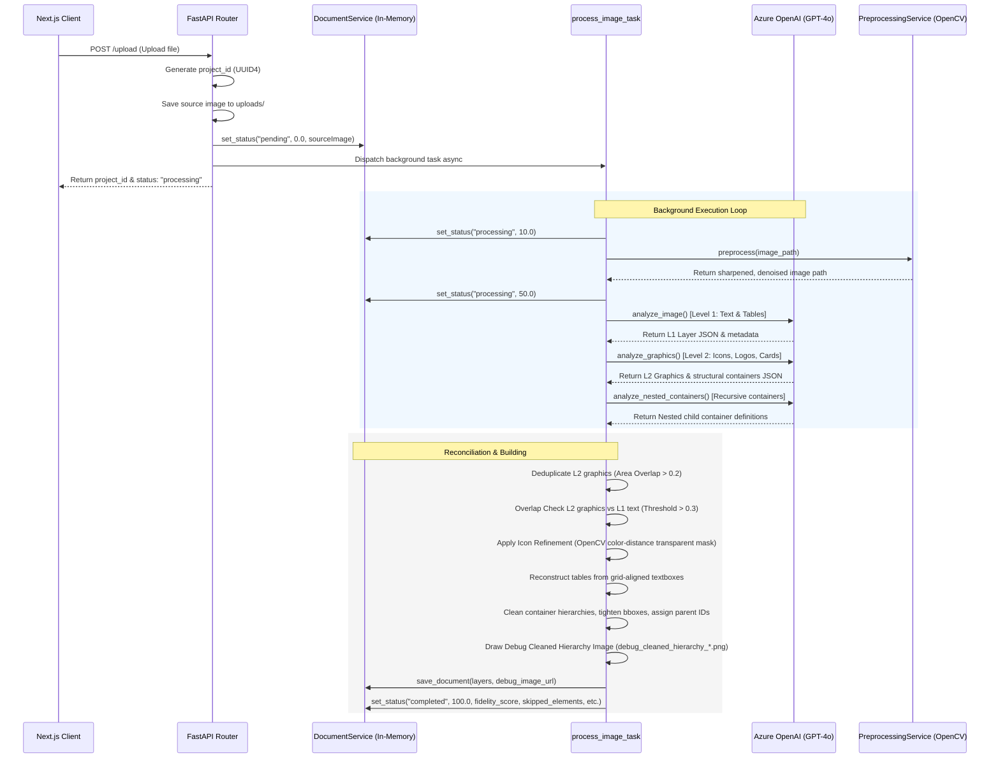

# Project Map: Editable Image to PPTX

This document provides a comprehensive structural mapping and architectural blueprint of the **Editable Image to PPTX** conversion monorepo. It details key services, pipelines, flows, and classifies codebase areas by safety and structural risk based strictly on verified source code inspection.

---

## 1. Architectural Structure Overview

The project is structured as a monorepo containing:
- **`/backend`**: A FastAPI application managing the vision-to-layout pipeline, image preprocessing, and PowerPoint reconstruction.
- **`/frontend`**: A Next.js 14 Web application providing a React Konva 2D interactive canvas editor.
- **`/shared`**: Shared TypeScript definitions and JSON Schemas standardizing the document data layer model across both layers.

---

## 2. Directory Mapping & Code Locations

### 2.1 Backend (`/backend`)
- **Pipeline Entry Point**: `backend/app/workers/tasks.py` (`process_image_task` coordinating background execution).
- **Core API Routes**:
  - `backend/app/api/routes/upload.py`: Accepts image, sets initial status, enqueues async processing.
  - `backend/app/api/routes/documents.py`: Serves status checks, layout fetches, and coordinates updates.
  - `backend/app/api/routes/export.py`: Invokes PPTX translation and streams `.pptx` bundle to client.
- **Services (The Pipeline and AI Engines)**:
  - `backend/app/services/pipeline_service.py`: Main orchestrator of the L1 and L2 vision extraction processes.
  - `backend/app/services/level2_orchestrator.py`: Coordinates the new modular Level 2 pipeline stages and compiles consolidated primitives back to Layer models.
  - `backend/app/services/stage1_extraction_service.py`: Level 2 Stage 1. Detects atomic shape contours, Hough line segments, text-gravity anchors, and snaps LMM candidate overlays.
  - `backend/app/services/stage1_5_reconstruction_service.py`: Level 2 Stage 1.5. Reconstructs visual cards, panels, borders, vertical/horizontal arrows, and dashed connectors.
  - `backend/app/services/stage1_75_consolidation_service.py`: Level 2 Stage 1.75. Eliminates raw contour noise via IoU suppression, concentric border collapsing, and micro-pruning.
  - `backend/app/services/stage2_separation_service.py` to `stage7_cleanup_service.py`: Subsequent Level 2 modular services (Separation, Spatial Graph, Clustering, Container Synthesis, Hierarchy Resolution, Cleanup/Validation) that are prepared and verified for future wiring.
  - `backend/app/services/preprocessing_service.py`: Uses OpenCV for CLAHE, unsharp masking, and colored denoising.
  - `backend/app/services/azure_service.py`: Contains `AzureVisionService` interacting with Azure OpenAI (GPT-4o) using Chat Completions JSON Mode for L1 elements (text/tables), L2 graphics (icons/logos), and Nested/Hierarchical Containers.
  - `backend/app/services/layout_hierarchy_service.py`: Algorithms to deduplicate containers, prune structural noise, assign parent-child relations, and tighten containment boundaries.
  - `backend/app/services/icon_refinement_service.py`: OpenCV pixel distance masking and morphological opening to extract high-res icons and background transparency.
  - `backend/app/services/pptx_service.py`: Generates the native PowerPoint slide with Textboxes (using a 0.75 scaling factor and 5% padding), Tables (using native shapes), and Images (using cropped sub-regions of the source image with 5% safety padding).
  - `backend/app/services/document_service.py`: Handles state management. Currently implemented as an **in-memory python dictionary store**, meaning it completely bypasses the database and will wipe state if the server restarts.
- **Configuration & Core**:
  - `backend/app/core/config.py`: Hardcoded path loading environment variables from `C:\secure_configs\.env`.
  - `backend/app/core/database.py`: Sets up SQLite database connection.
  - `backend/app/models/*.py`: Standard SQLAlchemy models (`Project`, `SourceImage`, `DocumentPage`, `DocumentLayer`) that are currently **completely unused** by the active routes.

### 2.2 Frontend (`/frontend`)
- **Landing page**: `frontend/app/page.tsx` (Provides the Dropzone upload experience).
- **Editor Route**: `frontend/app/document/[id]/page.tsx` (Handles 1s polling, retrieves document state, and mounts components).
- **State Store**: `frontend/store/documentStore.ts` (Zustand store capturing document layers, selected items, undo/redo history, page grid settings).
- **Canvas View**: `frontend/components/editor/EditorCanvas.tsx` (React Konva canvas drawing backgrounds, grids, low-opacity source image reference overlays, draggable editable text bounding boxes, grid cell text matrices, and level-2 cropped images).
- **Control Bar**: `frontend/components/editor/TopBar.tsx` (Coordinates manual saves, exports, undo/redo, and alerts skipped elements).
- **Properties**:
  - `frontend/components/editor/PropertyPanel.tsx`: Canvas properties or coordinates/text size settings.
  - `frontend/components/editor/TextLayerEditor.tsx`: Font family, font size, bold, italic, align, and color selectors.
  - `frontend/components/editor/TableLayerEditor.tsx`: Advanced row/column visual grid editor (supports adding/deleting rows & columns, and editing cell contents).

---

## 3. End-to-End Pipeline Flows

### 3.1 Upload → Processing Flow

### 3.2 Editor Flow
1. **Status Polling**: The React page in `document/[id]/page.tsx` polls `/api/v1/document/{id}/status` every 1 second.
2. **Data Mounting**: Once the status transitions to `"completed"`, it fetches `/api/v1/document/{id}`, updates the Zustand store with `setDocument()`, and disables the loading state.
3. **Canvas Interface**:
   - **Render**: Konva mounts a 1280x720 stage scaled fit to the browser size. It layers a canvas background fill, an optional grid, a reference image overlay, and interactive shapes.
   - **User Interacts**: Moving elements or adjusting sizing calls `updateLayer(id, updates)`, deep-merging content/style properties and updating history stacks (enabling instant Ctrl+Z Undo/Redo).
   - **Text & Tables**: Simple property fields enable instant modifications of text values, styles (weight, alignments), and table row/column count structures.
4. **Synchronization**: Pressing "Save" or executing an "Export" triggers a `PUT /document/{id}` containing current coordinates and layer details to synchronize changes to the server.

### 3.3 Export Flow
1. **Trigger**: User clicks "Export PPTX".
2. **Synchronize**: The frontend forces a manual `updateDocument` sync so the latest canvas updates are written to the server's memory.
3. **Download Request**: A `GET /export/{id}/pptx` call is sent.
4. **PPTX Synthesis**:
   - Backend retrieves layers from `document_service`.
   - `pptx_service` instantiates python-pptx with blank slides set to 16:9 (`slide_width = Inches(13.333)`, `slide_height = Inches(7.5)`).
   - Solid slide background is colored based on the detected layout hex color.
   - `_add_text` translates pixel sizes using a `PT_PER_PX = 0.75` modifier, adds a 5% width buffer, removes margins, and activates word-wrapping.
   - `_add_table` creates native PowerPoint tables populated with styled text cells.
   - `_add_image` retrieves the original high-resolution image, crops the specific layer coordinate region (with a 5% safety margin to prevent border clipping), writes it to an RGBA byte buffer, and appends it to the slide.
5. **Streaming**: The completed PPTX byte buffer is piped as a `StreamingResponse` along with custom `X-Skipped-Elements` and `X-Fidelity-Score` headers. The browser triggers a save file prompt.

---

## 4. Level 1 vs. Level 2 Implementations

| Feature | Level 1: Primary Elements | Level 2: Additive Graphics & Structure |
| :--- | :--- | :--- |
| **Element Types** | Text (headings, body paragraphs, node labels) and Grid Tables. | Icons, logos, device mockups, cards, side panels, cards, and card groupings. |
| **AI Extraction Location** | `AzureVisionService.analyze_image()` (in `azure_service.py`) using Chat Completions. | `AzureVisionService.analyze_graphics()` and recursively `analyze_nested_containers()`. |
| **Table Extraction Method** | Handled natively by Azure OpenAI prompt OR reconstructed via Y-coordinate sorting & column matching in `pipeline_service.py` (`_reconstruct_tables`). | N/A (Only graphical elements are managed). |
| **Post-AI Refinements** | Sorting by coordinates to arrange natural PPTX keyboard tab indexes. | Deduplication, L1 overlap checking, boundary tightening, boundary transparency removal. |
| **Safety Integration** | N/A (Always prioritized as source-of-truth). | If an L2 graphic overlaps an L1 element by > 0.3, it is automatically skipped and added to the Skipped Report. |
| **PPTX Representation** | Native editable text frames and native PowerPoint tables. | Native cropped image files (PNG) with alpha channel backgrounds. |

---

## 5. Directory Modifiability & Safety Classification

We categorize code regions based on their role and safety profile:

### 5.1 Safe to Modify
*These contain feature business logic, layouts, configurations, and user interfaces that can be updated with low structural impact.*
- **Frontend Pages & Components**: `/frontend/components/editor/*`, `/frontend/app/*`
- **Frontend Stores & API**: `/frontend/store/documentStore.ts`, `/frontend/lib/api.ts`
- **Backend Routing**: `/backend/app/api/routes/*`
- **DB Operations & Models** (if database persistence is introduced): `backend/app/models/*`

### 5.2 Should Remain Untouched
*Framework infrastructures, standard models, and library dependencies.*
- **Monorepo setup files**: `package.json`, `pnpm-workspace.yaml`, `backend/pyproject.toml`, `backend/poetry.lock`
- **FastAPI Core Init**: `backend/app/main.py`, `backend/app/core/database.py`, `backend/app/api/router.py`

### 5.3 Risky Areas (Math, Coordinate Scales, Spatial Geometry)
*Files executing spatial mathematics, overlap geometry, threshold cropping, or coordinate mappings. Changes can break layouts, cause PPTX alignment shifts, or crash image crops.*
- **`backend/app/services/pptx_service.py`**: Font size conversions (`0.75`), padding buffers (`1.05`), and crop bounds validation.
- **`backend/app/services/icon_refinement_service.py`**: Pixel conversions from 1280x720 to high-res boundaries, OpenCV masking threshold math.
- **`backend/app/services/layout_hierarchy_service.py`**: Bounding box IoU thresholds, enclosure ratios (`0.85`), container shrinking, and parenting logic.
- **`backend/app/utils/image_utils.py`**: Debug image drawers, scale factors, line markers, and raw crop boundaries.

### 5.4 Prototype-style Areas
*Active code written rapidly using mock arrays, placeholders, or in-memory stores that lack enterprise robustness.*
- **`backend/app/services/document_service.py`**: Holds state in transient python dicts. No DB calls are made. State is wiped upon server reboot.
- **`backend/app/services/preprocessing_service.py`**:
  - `_deskew()` is a placeholder that returns the image untouched.
  - `cv2.fastNlMeansDenoisingColored` is very CPU-heavy and may lock the worker thread on massive files.
- **Model Files Layout (`backend/app/models/*.py`)**: Extremely mismatched filenames where `edit_history.py` defines `DocumentLayer`, and `document_layer.py` defines `DocumentPage`. This must be cleaned if DB support is turned on.
- **`backend/app/services/document_builder_service.py`**: Used only when AI fails. Returns mock table array matrices.
